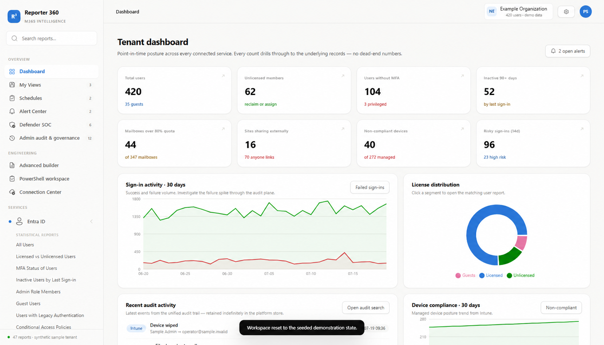

# M365Intelligence

M365Intelligence is a local-first, open-source Microsoft 365 operations workspace. It brings reporting, Microsoft Defender SOC triage, administrator audit evidence, governance workflows, and export-ready views into one customer-controlled deployment.

> **Release status:** This repository is an evaluation-ready open-source foundation. Its bundled information is generated, generic sample data. It does not include a customer tenant, customer credentials, tokens, certificates, or real Microsoft 365 activity.



## Why M365Intelligence

- **Customer-controlled by design.** Run the application and its data services in infrastructure you control.
- **One operational surface.** Explore Microsoft 365 reporting, security operations, administrative audit, governance, and scheduled delivery in a unified portal.
- **Useful before a tenant connection.** The included synthetic workspace lets teams evaluate filters, reports, exports, saved views, alerts, and workflows without exposing tenant data.
- **Transparent integration boundary.** Live Microsoft Graph collection and real remediation are disabled by default and are never presented as live data when the source is synthetic.
- **Open for review and extension.** The source, deployment materials, security documentation, and contribution workflow are available under Apache-2.0.

This is intentionally not a hosted telemetry service. A customer deployment only communicates with Microsoft services or other integrations that its administrator explicitly configures and authorizes. Review [the Microsoft 365 connection boundary](#connect-microsoft-365) before enabling any integration.

## Included workspaces

- **Reporter 360:** report catalogue, dashboards, quick/easy/advanced filtering, saved views, schedules, alerts, and CSV, Excel, and PDF exports.
- **Security operations:** synthetic Defender-style alert and incident investigation views, evidence timelines, ownership, response playbooks, and audit trails.
- **Administrator audit:** cross-workload administrative activity timeline, high-risk change investigation, before/after context, compliance evidence, and reports.
- **Governance:** findings, approvals, exceptions, remediation simulation, rollback records, and immutable-style event history.
- **PowerShell workspace:** searchable operational command reference and copy-ready runbook snippets. Commands must be reviewed and run by an authorized administrator in their own environment.

## Quick start: local evaluation

### Prerequisites

- Node.js 22 LTS or newer
- npm and Git
- Windows PowerShell on Windows (the included convenience launcher is PowerShell)
- Docker Desktop only for the full container stack

Clone the public repository, install the two applications, then generate an administrator password that remains local and git-ignored:

```powershell
git clone https://github.com/imtiax/M365Intelligence.git
cd M365Intelligence

cd apps\web
npm.cmd ci
npm.cmd run auth:setup

cd ..\api
npm.cmd ci

cd ..\..
powershell -ExecutionPolicy Bypass -File .\scripts\start-acceptance.ps1 -ResetData
```

`auth:setup` prints the local username and password once. Save the password in your approved password manager. Open [http://localhost:3008/login](http://localhost:3008/login) and sign in. The convenience launcher starts the API on port `3001`, the application on `3008`, and the isolated synthetic tour at [http://localhost:3008/landing/demo](http://localhost:3008/landing/demo).

### Docker deployment

```powershell
Copy-Item .env.example .env
# Replace every CHANGE_ME value with a unique secret before starting.
docker compose up --build -d
docker compose ps
```

Open [http://localhost:8080](http://localhost:8080). Docker keeps database and queue services on internal networks; only Nginx exposes port `8080`. Do not use development defaults or the example secrets outside a disposable evaluation environment.

For optional local search, AI, or observability services, add `--profile search`, `--profile ai`, or `--profile observability` to the Docker command. Stop containers with `docker compose down`; add `-v` only when you intentionally want to erase local volumes.

## Demo data and safety

The repository includes a deterministic sample organization, `Example Organization`, using reserved `*.invalid` identities. It exists solely to exercise the UI and end-to-end checks. It is not customer data and no bundled report, alert, user, device, or event is a live Microsoft 365 record.

Do not commit any of the following:

- `.env` files, passwords, tokens, keys, certificates, or signed exports
- Microsoft tenant IDs, user principal names, device names, IP addresses, audit records, or screenshots containing customer data
- database volumes, runtime state, browser artifacts, or production configuration

The repository ignores those common local artifacts. Run a secret scan and a privacy review before each pull request or release.

## Connect Microsoft 365

Live tenant collection is an integration boundary, not a switch that turns sample data into production data. The included `M365_*` and Entra variables reserve the deployment contract; production collectors and live mutation paths require their own release gates, tests, and administrator approval.

When implementing a connection:

1. Use a dedicated, single-tenant Entra application or managed identity per customer environment.
2. Prefer certificate or workload-identity authentication; do not store a production client secret in the repository.
3. Request only the Microsoft Graph permissions needed by enabled read-only modules, obtain documented tenant-admin consent, and review them regularly.
4. Keep credentials in a protected runtime secret store and enable write/remediation permissions only through a separate governed identity and approval path.
5. Validate tenant isolation, throttling handling, audit logging, retention, restore, and failure behavior before production use.

See [docs/MICROSOFT-365-CONNECTION.md](docs/MICROSOFT-365-CONNECTION.md), the [security architecture](docs/architecture/security.md), and the [threat model](docs/architecture/threat-model.md).

## Verify a checkout

```powershell
# API unit and build verification
cd apps\api
npm.cmd run build
npm.cmd test

# With the local environment running, exercise the Reporter 360 portal.
cd ..\web
npm.cmd run test:portal
```

The portal check validates dashboard drill-through, filtering, saved views, schedules, alerts, live CSV/Excel/PDF exports, record details, workspace reset, and sign-out. It writes a local ignored screenshot under `apps/web/artifacts`.

## Contributing

Contributions are welcome. Please read [CONTRIBUTING.md](CONTRIBUTING.md), follow the [Code of Conduct](CODE_OF_CONDUCT.md), sign off commits under the [Developer Certificate of Origin](DCO.md), and use the issue and pull-request templates. For vulnerabilities, do **not** open an issue; follow [SECURITY.md](SECURITY.md).

The initial public roadmap and release gates are in [docs/roadmap.md](docs/roadmap.md). Consult [SUPPORT.md](SUPPORT.md) for community support boundaries and [TRADEMARKS.md](TRADEMARKS.md) for fair-use guidance.

## License

Copyright 2026 M365Intelligence contributors. Licensed under the [Apache License 2.0](LICENSE).
