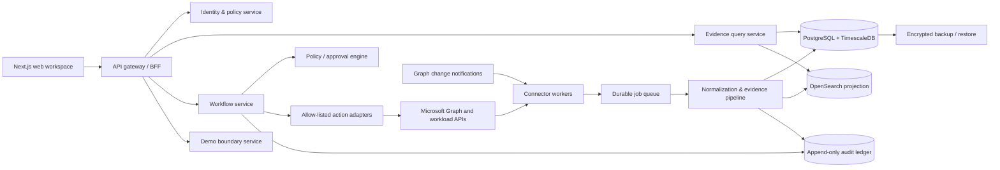

# Aegis Next — original enterprise rebuild blueprint

**Status:** approved engineering baseline
**Audience:** product, security, platform, frontend, backend, and demo engineering
**Deployment default:** customer-managed, local-first Microsoft 365 intelligence platform
**Design rule:** build original Aegis experiences. Do not reproduce another vendor's assets, source code, copy, names, or screen layouts.

## 1. Product decision

Aegis Next is a governed Microsoft 365 intelligence and operations platform. It gives security, IT operations, compliance, finance, and managed-service teams one place to understand tenant state, investigate activity, retain evidence, and carry out approved remediation.

The product is deliberately split into two trust boundaries:

| Boundary | Purpose | Data policy |
| --- | --- | --- |
| **Customer workspace** | Connected tenant, historical evidence, reports, delegated work, and approved actions | Customer data remains in the customer's deployment. |
| **Public experience** | Buyer evaluation, guided scenarios, and realistic but synthetic example data | No tenant connection, no real identities, no persistent customer data. |

The default product posture is read-only. Write actions are opt-in capabilities that need a separate consent set, policy evaluation, step-up authentication, approval, execution record, and reversible plan where Microsoft APIs permit it.

## 2. Competitive research translated into original requirements

The competitive study identified the market expectation: a broad service catalogue, repeatable reporting interactions, direct drill-through, scheduled delivery, delegated administration, object-centric context, and local retention. Aegis Next will use those problem-space expectations but introduces an original organizing principle: **evidence-to-action journeys**.

Every user journey follows the same chain:

```text
Signal → Evidence → Scope → Decision → Controlled action → Verifiable outcome
```

This is the Aegis gap strategy. Rather than exposing disconnected reports, the product preserves the evidence, makes the scope explicit, explains the policy decision, and records the outcome beside the finding.

### First-release product surfaces

| Surface | Customer job | Original Aegis capability |
| --- | --- | --- |
| **Mission Control** | Know what needs attention now | Role-aware risk, cost, resilience, and compliance briefing with drillable evidence cards. |
| **Service Atlas** | Find the right data quickly | Service tree: Entra, Exchange, Teams, SharePoint, OneDrive, Defender, Purview, Intune, Licensing, Hybrid AD; each has **Inventory**, **Activity**, and **Trends** planes. |
| **Evidence Studio** | Build trustworthy reports | A universal report contract: source, scope, filters, columns, sort, chart, joins, view, schedule, export, and audit receipt. |
| **Object 360** | Understand one user, mailbox, site, team, app, or device | Relationship graph, historical timeline, permission exposure, evidence, and only authorized actions. |
| **Policy Workbench** | Turn controls into operating practice | Control mapping, evidence freshness, exceptions, ownership, due dates, and attestations. |
| **Action Center** | Make safe operational changes | Dry run, impact preview, approvals, separation of duties, execution progress, compensation, and immutable receipt. |
| **Delegation Studio** | Give people only the right visibility/action scope | Data-scoped roles, resource scopes, preview-as-delegate, access review, and administrator activity history. |
| **Demo Gallery** | Let buyers validate the product | Guided industry stories with synthetic but coherent tenants, resettable state, and a clearly visible no-real-data boundary. |

### Gaps Aegis will own

1. **Evidence receipts for every decision.** Report exports, alerts, exceptions, and workflow outcomes carry source freshness, query definition, policy/rule version, actor, and correlation ID.
2. **Cross-service blast-radius preview.** Before an approved action, show affected identities, access paths, licenses, collaboration objects, and compliance controls.
3. **Control-to-remediation traceability.** A customer can move from framework clause to evidence, exception, owner, action, and verified closure without spreadsheet joins.
4. **Buyer-safe realism.** Public demos use isolated synthetic tenants and demonstrable workflows, not screens with dead buttons or simulated production access.
5. **Permission-contract onboarding.** Each connector capability declares the exact API permissions, retention, data classes, and action capabilities before consent.

## 3. Experience architecture

### 3.1 Navigation

The navigation is task-first at the top level and service-first inside data exploration:

```text
Mission Control
Investigate
  ├─ Service Atlas
  ├─ Object 360
  └─ Evidence Studio
Operate
  ├─ Action Center
  ├─ Automation
  └─ Alerts
Govern
  ├─ Policy Workbench
  ├─ Delegation Studio
  └─ Retention & Audit
Connect
  ├─ Tenant onboarding
  ├─ Connector health
  └─ Data contracts
Demo Gallery (public/demo only)
```

Service Atlas has the stable structure:

```text
Service → Inventory (current state) | Activity (events) | Trends (time series)
```

### 3.2 Universal report contract

No report is complete unless it implements the following contract.

```ts
type EvidenceReport = {
  id: string;
  source: { connector: string; dataset: string; freshness: string; coverage: string };
  scope: { tenantId: string; resourceScope?: string[]; timeWindow?: string };
  definition: { filters: Filter[]; columns: Column[]; sorts: Sort[]; joins: Join[]; chart?: ChartSpec };
  output: { rows: unknown[]; total: number; evidenceReceipt: Receipt };
  operations: { saveView: boolean; schedule: boolean; alert: boolean; export: ExportFormat[] };
};
```

Required interaction behavior:

- Counts, chart marks, and relationship summaries open the records that produced them.
- Easy filters become visible, editable query clauses; quick filters arise from values in a row.
- Views save definition, not copied rows; shared views have owners, visibility, and revision history.
- Exports support CSV, XLSX, PDF, HTML, and signed raw JSON with the evidence receipt.
- Scheduled reports use an explicit intelligent time-window rule, in-body preview, empty-result policy, destination approval, and delivery audit trail.

### 3.3 Object 360 contract

Object 360 is a generic composition, not a set of one-off pages:

```text
Identity / resource summary
  + relationships and delegated access
  + activity timeline and change provenance
  + risk / cost / compliance evidence
  + available guarded actions
```

The first object types are User, Mailbox, Team, Site, Application, Device, and License Assignment. Permission trees are introduced only after durable collection and relationship normalization are operational.

## 4. Target full-stack architecture



### Bounded contexts and ownership

| Context | Owns | Initial technology | Exit criterion |
| --- | --- | --- | --- |
| Identity and access | OIDC, sessions, local break-glass, RBAC/ABAC | NestJS + Entra OIDC | MFA/step-up and role tests pass. |
| Connector registry | Consent contracts, grants, health, cursors | NestJS + Postgres | Each connected capability is visible and revocable. |
| Collection | Delta scans, webhooks, retries, throttling | Node workers + RabbitMQ | Replay-safe and idempotent per tenant. |
| Evidence twin | Canonical resources, events, relationships, snapshots | Postgres/Timescale | Queryable historical evidence with tenant RLS. |
| Evidence Studio | Report definitions, views, exports, schedules | BFF + worker jobs | One contract powers all report types. |
| Intelligence | Rules, baselines, anomaly and cost models | Worker jobs | Findings cite versioned evidence. |
| Governance | Controls, exceptions, attestations, retention | Postgres + workflow jobs | Control evidence survives review and export. |
| Operations | Actions, approval, execution, compensation | Workflow service | No write executes without policy and audit. |
| Demo | Synthetic tenant state and guided scenario replay | Separate demo store | Cannot call customer connector/action routes. |

## 5. Microsoft 365 integration architecture

### Authentication modes

| Scenario | Flow | Storage and controls |
| --- | --- | --- |
| Human application sign-in | Entra OIDC authorization code + PKCE through MSAL | HttpOnly, secure, SameSite session cookie; token cache encrypted; short session and reauthentication policy. |
| Background read collection | Customer-controlled Entra application with certificate credential | Certificate in OS/KMS secret store; app-only scopes per enabled connector; no user password stored. |
| Guarded actions | Dedicated action application or delegated OBO capability | Separate consent set; step-up MFA, policy and approval re-check immediately before execution. |
| MSP onboarding | Partner/GDAP capability, isolated tenant records | Explicit customer association and tenant partition checks. |

### Collection policy

1. Use Graph delta queries and change notifications where a workload supports them; retain an encrypted cursor per tenant/dataset.
2. Treat notification as a trigger and delta as the source of truth; run bounded reconciliation scans.
3. Respect `Retry-After`, use jittered exponential backoff, record throttle events, and surface connector freshness in the UI.
4. Collect minimum durable normalized fields. Raw provider payloads are encrypted, access-controlled, and short-lived.
5. Model source coverage rather than implying completeness: `fresh`, `delayed`, `partial`, `unavailable`, or `not-authorized`.

### Initial permission packs

Permission grants are requested only when the customer enables a pack. The UI presents the exact Graph permission, purpose, data classes, write capability, retention, and revocation impact before an administrator approves it.

| Pack | First datasets | Default mode |
| --- | --- | --- |
| Entra Identity Read | users, groups, roles, sign-ins, directory audit, applications | read-only |
| Exchange Security Read | mailbox metadata, forwarding and permission indicators, audit evidence | read-only |
| Collaboration Read | Teams, SharePoint, OneDrive metadata, usage and sharing indicators | read-only |
| Security & Compliance Read | incidents, alerts, Secure Score, Purview metadata | read-only |
| License Intelligence | subscriptions, assignments, activity evidence | read-only |
| Approved Operations | selected account/license/group actions | disabled until explicitly enabled |

## 6. Security architecture and mandatory controls

### Identity and authorization

- Entra SSO is the production default. Local break-glass accounts exist only for an offline/customer-managed emergency and require a rotating secret, audited use, and setup-time acknowledgement.
- Enforce MFA through tenant Conditional Access; require a fresh authentication claim for high-impact operations.
- Authorize every request using product role, resource scope, tenant, environment, and action sensitivity. Never rely on hidden UI controls.
- Enforce database row-level security using the tenant ID derived from a validated identity/session—not a client-supplied header.
- Require two-person approval for high-impact actions and prevent requester self-approval.

### Data protection

- TLS 1.2+ externally, mTLS for internal worker paths where deployed beyond one node.
- Envelope encryption for connector credentials and raw payloads; keys held outside application containers.
- Hash-chain audit records, periodic signed roots, and an optional immutable external export target.
- Content metadata only by default. File/message content collection is an explicit, separately consented capability and excluded from AI unless its policy allows it.
- Retention policies apply by data class and tenant. Purge jobs generate auditable deletion receipts.

### Product and supply-chain security

- Security headers, strict CSP without broad production `unsafe-*`, CSRF protection for cookie-backed mutations, rate limits, payload limits, structured redacted logs, and dependency vulnerability scanning.
- SBOM, pinned image digests, signed build artifacts, secret scanning, IaC scanning, and image admission verification in the production release pipeline.
- SAST/DAST, role/tenant isolation tests, workflow abuse tests, Graph contract tests, backup restore exercises, and threat-model review release gates.
- Local AI is advisory, receives only policy-filtered retrieval, cannot call arbitrary tools, and cannot initiate a write operation.

## 7. Infrastructure requirements

### Customer-managed baseline

| Component | Production responsibility |
| --- | --- |
| Edge | TLS termination, WAF/reverse proxy, hardened headers, rate limits |
| Web/API | Stateless replicas, read-only filesystems, workload identities |
| Workers | Separate execution pool with per-tenant concurrency and backpressure |
| PostgreSQL + Timescale | Encrypted persistent volumes, point-in-time recovery, daily encrypted backup |
| RabbitMQ/Redis | Durable queues, no public ingress, password rotation |
| OpenSearch | Optional rebuildable projection; encrypted storage and restricted access |
| Secrets | Customer KMS/Vault/OS certificate store; never `.env` in production |
| Observability | Metrics, logs, traces, alerts; no raw secrets/customer content in logs |

### Sizing hypotheses for pilot

| Tenant size | API/web | Workers | Database | Notes |
| --- | --- | --- | --- | --- |
| Up to 2,500 users | 2 vCPU / 4 GB each | 2 vCPU / 4 GB | 4 vCPU / 16 GB | Start with Entra, licensing, and audit packs. |
| 2,500–25,000 users | 4 vCPU / 8 GB each | 4–8 vCPU / 8–16 GB | 8 vCPU / 32 GB | Use Timescale retention tiers and connection pooling. |
| MSP / multi-tenant | Horizontally scaled | Dedicated queue partitions | HA Postgres | Capacity is driven by event volume and retention, not only seats. |

These are planning starting points and must be validated with tenant data volume, enabled workloads, retention, and schedule concurrency.

## 8. Delivery sequence and acceptance gates

### Phase 0 — foundation and replacement safety

- Freeze the current demo as a tagged reference; do not delete it until Aegis Next has feature and migration acceptance.
- Create a new `next` application boundary and shared design system, then move modules one at a time.
- Replace the JSON runtime with repository interfaces and a PostgreSQL-backed evidence store; preserve a synthetic provider for demos.
- Define the permission contract, data classification, retention policies, threat model, and tenant isolation tests first.

**Gate:** authenticated local install, public demo isolation, encrypted secret handling, and tenant boundary negative tests pass.

### Phase 1 — buyer-visible core

- Mission Control, Service Atlas, Evidence Studio, universal report contract, Object 360 for User and License Assignment.
- Demo Gallery with three industry narratives: financial services, healthcare, and professional services.
- CSV/XLSX/PDF/HTML/raw export receipts, views, scheduled delivery simulation, drill-through, and no-dead-CTA browser tests.

**Gate:** a buyer can complete an evidence-to-action scenario without guidance; every button has a tested result or intentionally disabled reason.

### Phase 2 — connected tenant pilot

- Entra Identity Read, License Intelligence, audit/Sign-in ingestion, connector health, schedules, and retention controls.
- Entra SSO/MFA posture, data-scoped delegation, action centre dry run, approval workflow, audit ledger.

**Gate:** a pilot customer sees real connected evidence with freshness/coverage displayed and can prove a delegated user cannot escape scope.

### Phase 3 — expansion and operations

- Exchange, Teams, SharePoint, OneDrive, Defender, Purview, Intune connector packs.
- 360 relationship graphs, trend alerts with historical preview, compliance frameworks, backup/restore, action adapters, and automation.

**Gate:** operational readiness review: disaster recovery, security test evidence, performance/load profile, consent review, and runbooks are signed off.

## 9. Definition of done

A release is not called complete because a screen is present. It is complete only when:

1. The workflow has a durable backend model, API validation, authorization enforcement, an audit event, and a user-visible outcome.
2. Connected-data features visibly label source freshness, coverage, and collection errors.
3. Demo features run against isolated synthetic data and cannot mutate a connected tenant.
4. Every CTA is executable, has explicit preconditions, or explains why it is unavailable.
5. Accessibility, responsive behavior, error states, empty states, download behavior, and role boundaries have browser coverage.
6. The release passes security, migration/backup, dependency, and tenant-isolation gates.

## 10. Research sources and design assumptions

- Microsoft Graph’s current guidance favors delta queries plus change notifications to keep a local store synchronized and reduce polling/throttling risk.
- Microsoft Graph requires client handling of 429 responses with `Retry-After` or backoff.
- Microsoft identity guidance supports authorization-code flow with PKCE/OIDC and MSAL for human web sign-in; client credentials are reserved for daemon-style app-only access.
- Microsoft Entra guidance supports least privilege, MFA, access review, and just-in-time privileged access for administrative operations.

The product must revalidate source capabilities and Graph permission availability during implementation; provider APIs and licensing constraints change over time.
