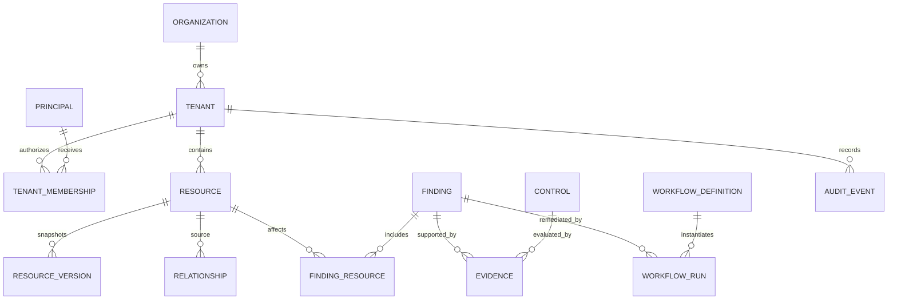

# Data model and temporal digital twin

Core tables use UUIDv7-style sortable identifiers where available, UTC timestamps, optimistic concurrency, and `tenant_id` on every customer-data record.

- `resources`: stable canonical identity (`provider`, `resource_type`, `external_id`, display metadata).
- `resource_versions`: bitemporal normalized document with `valid_from`, `valid_to`, `observed_at`, schema version, content hash, and encrypted raw-payload reference. A partial unique index identifies the current version.
- `relationships`: typed, time-bounded edges such as MEMBER_OF, OWNS, ASSIGNED_LICENSE, and MANAGED_BY.
- `signals`: append-only security/activity observations stored as Timescale hypertables.
- `findings`: rule-derived condition, severity, confidence, business impact, recommendation, lifecycle, owner, due date, and rule version.
- `evidence`: immutable fact/result hashes mapped to findings and compliance controls.
- `workflow_runs/steps`: approval, execution, idempotency key, before/after state, and compensation status.
- `audit_events`: append-only hash chain partitioned by time and tenant.

Historical queries choose resource versions whose validity interval contains the requested instant. Corrections preserve observation time separately from business validity. Retention policies aggregate old signals before deletion; legal holds override deletion and are audited.

Indexes include `(tenant_id, resource_type, external_id)`, GiST validity ranges, `(tenant_id, severity, status)`, JSONB GIN only for approved normalized attributes, and time/tenant indexes on signals. OpenSearch documents contain tenant routing and no secrets.

