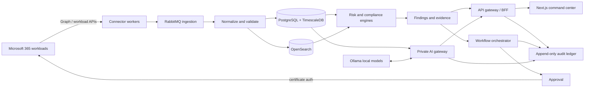

# Enterprise architecture

## Scope and principles

The platform is a sovereign Microsoft 365 intelligence plane deployed inside a customer's trust boundary. It collects the minimum authorized data, maintains a temporal digital twin, evaluates that twin with deterministic controls and local models, and routes recommendations through approval-aware workflows. It is not placed inline with Microsoft 365 and cannot interrupt Microsoft services.

Architecture principles are Zero Trust, tenant isolation, least privilege, evidence over opinion, local processing, idempotent collection, immutable accountability, reversible automation, and graceful degradation.

## Logical architecture

## Bounded contexts

| Context | Responsibilities | Initial deployment |
|---|---|---|
| Identity and access | Federation, local break-glass, sessions, RBAC/ABAC | API module |
| Tenant management | Tenant onboarding, connector grants, collection policy | API module |
| Collection | Graph/workload adapters, cursors, throttling, replay | Worker boundary |
| Digital twin | Canonical resources, relationships, temporal snapshots | PostgreSQL |
| Intelligence | Rules, baselines, anomaly scoring, findings | API/worker module |
| Compliance | Framework mappings, controls, evidence, exceptions | Worker module |
| License intelligence | SKU cost, assignment, activity and recommendations | Worker module |
| Reporting | Semantic model, scheduled reports, exports | Worker module |
| Automation | Playbooks, approval, execution, compensation | Worker module |
| Private AI | Retrieval, policy enforcement, local inference | Isolated gateway |
| Audit | Tamper-evident event ledger and export | Dedicated schema |

Modules begin as a modular monolith for transactional clarity and operational simplicity. Collection, analytics, export, and AI workers scale independently and can be extracted behind versioned events when load or organizational ownership requires it.

## Data classification

- Restricted: tokens, certificates, encryption material. Stored only in Vault/OS protected stores; never indexed or exposed to AI.
- Confidential: identity, device, sign-in, alert, content metadata. Encrypted, tenant-scoped, retention-controlled.
- Internal: configurations, findings, compliance evidence, cost data.
- Public: product help and non-customer reference control catalogs.

## Availability and scale targets

- Control plane target: 99.9% within a customer's deployment.
- RPO: 15 minutes; RTO: 4 hours by default, configurable per organization.
- Collection is at-least-once with idempotency keys and persisted delta cursors.
- Interactive API p95 target: 500 ms for indexed queries; long work is asynchronous.
- Tenant partitions, time-based hypertables, and retention tiers support large histories.

## Key decisions

1. PostgreSQL is the source of truth; OpenSearch is a rebuildable projection.
2. Every row carrying customer data includes `tenant_id`; PostgreSQL row-level security is defense in depth.
3. Findings reference immutable evidence and rule versions so results remain explainable.
4. AI is advisory. Mutations require an allow-listed tool, authorization re-check, policy validation, approval when applicable, and audit.
5. Raw provider payloads are short-lived and encrypted; normalized minimum fields form the durable twin.

